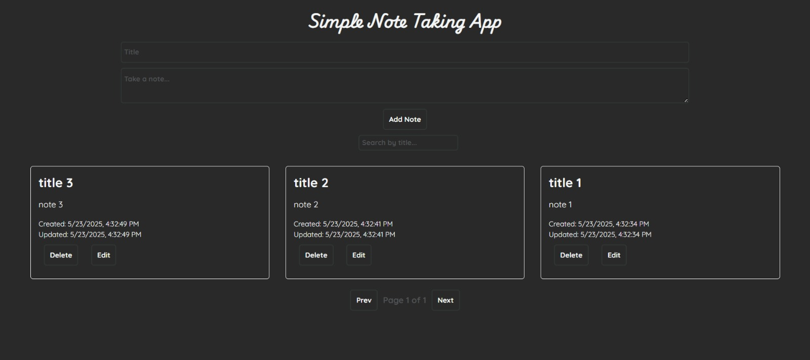

# 📝 Simple Note-Taking App

A lightweight, browser-based note-taking app that allows users to create, edit, and manage notes with ease. Designed for simplicity and ease of use, using plain JavaScript, HTML, and CSS—no frameworks or libraries required.


## 🚀 Features

- ✅ Create new notes
- ✅ Edit existing notes using a custom modal interface
- ✅ Delete notes
- ✅ Automatically saves notes to `localStorage`
- ✅ Only Dark mode
- ✅ Minimal and user-friendly interface
- ✅ Pagination feature
- ✅ Search / Filter using title of note


## 🖼️ Screenshot

  
*A clean and simple UI for editing your notes.*


## 🔧 Technologies Used

- HTML5
- CSS3
- JavaScript (ES6)


## 📁 Project Structure

📦 note-app /

├── note.html # Main HTML page

├── note.css # App styling

├── note.js # Core functionality

└── README.md # Project documentation


## 💻 Getting Started

To run the project locally:

1. Clone the repository:
   ```bash
   git clone https://github.com/your-username/note-app.git
   cd note-app
2. Open ntoe.html in your browser

That's it! The app runs entirely in the browser and doesn't require a backend.


## ✏️ How to Use
Create a note.

Click "Edit" to open a modal and modify the note content.

Click "Save" to update the note or "Cancel" to discard changes.

Notes persist even after you refresh the page thanks to localStorage.
